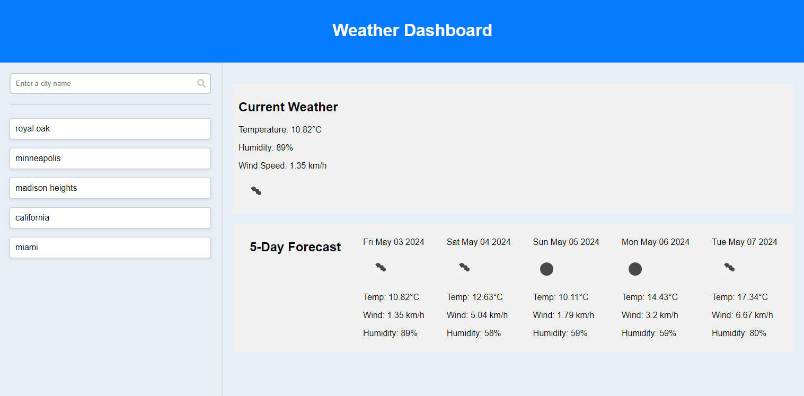

# WeatherDashboard

# Description

This Weather Dashboard was created for users to view current and future weather forecasts. We implemented a third-part weather API, where we would pull weather data to search through based on a city or zipcode. Once searched the dashboard would pull current weather via the weather API to preview on the webpage. 

# Mock-Up

# Deployed Application 

[Live Link](https://j3rryb0y13.github.io/My-First-Blog/)